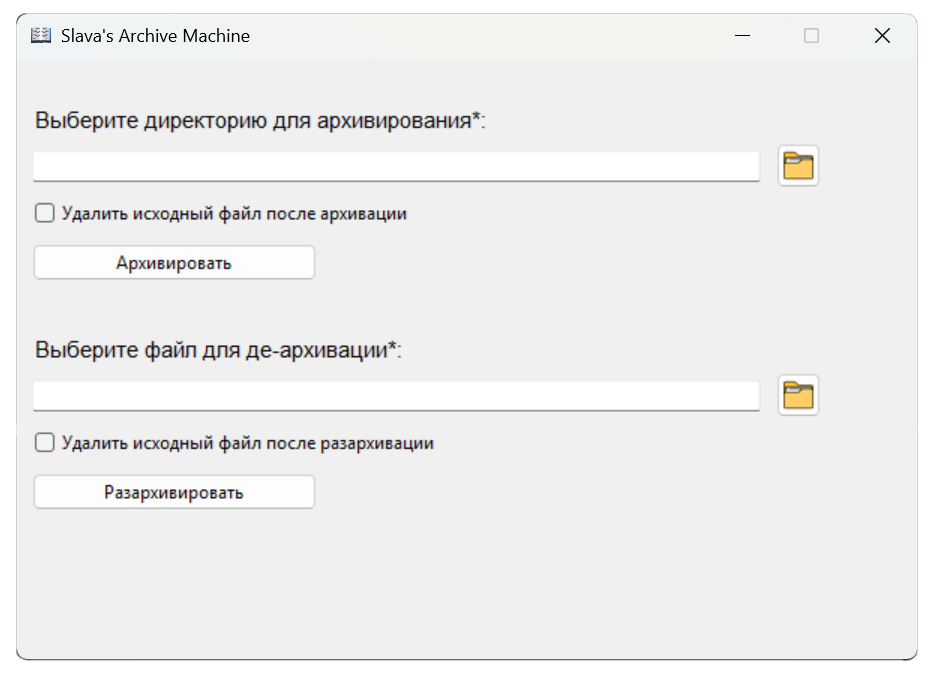

# TkinterArchiveMachine - программа для архивирования и разархивирования папок (Windows)
____



## Установка и запуск
____
### 1. Установить Python версии 3.12+ с [официального сайта](https://www.python.org/)
### 2. Установить Poetry, используя *pip*
```bash
pip install poetry
```
### 3. Склонировать проект из GitHub на локальную машину, например через HTTPS
```bash
git clone <ссылка>
```
### 4. Перейти в директорию проекта
### 5. Установить зависимости
```bash
poetry install --no-root
```
### 6. Запустить программу
```bash
poetry run python main.py 
```

# Stack
____
+ ### Python 3.12
+ ### Poetry
+ ### requests
+ ### aspose-zip
+ ### pillow

##  В планах
___
+ ### лучший дизайн интерфейса
+ ### поддержка других операционных систем (Linux, Mac)